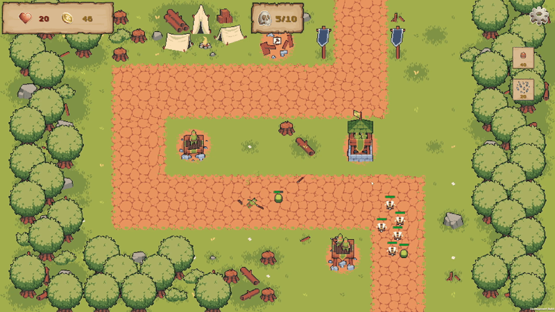

# Hold The Border 2D

Hold The Border 2D — это 2D-прототип Tower Defense

---

## Цели проекта
Основная цель проекта — создать презентабельный (с точки зрения кода), легко расширяемый как новым контентом, так и новыми механиками прототип 2D Tower Defense.
- Создать архитектуру, в которую легко добавлять новый контент (новые типы врагов/башен/умений/волн/уровней) и новые механики, следуя принципу Open-Closed из SOLID.
- Написать код, который следует стандартам индустрии, и продемонстрировать понимание того, где и почему применяются различные принципы и паттерны.
- Закрепить на практике работу с паттернами проектирования и инструментами, которые помогают строить архитектуру в GameDev.

---

## Реализованные механики
1. Главное меню с функциональностью:
   - Перейти на панель уровней, где можно выбрать, какой уровень пройти
   - Перейти на панель настроек, где можно изменить:
      - Качество графики
      - Громкость звуков
      - Громкость окружения
      - Громкость музыки
   - Выйти из игры
2. Функционал постройки, продажи и улучшений башен
3. Функционал вражеских юнитов, движущихся по заранее созданным маршрутам к базе игрока
4. Функционал умений с временем восстановления, которые можно применять за золото

Данный пункт кратко описывает основные механики игры. Подробная информация об архитектуре механик смотреть в пункте **«Архитектура»**

---

## Архитектура
1. Bootstrapper скрипты зарегистрированы в DI-контейнерах как точки входа (`IStartable`) и запускают первичный запуск соответствующих сцен. Это даёт централизованный, контролируемый доступ к настройке систем сцены, а также позволяет избежать проблемы неправильного порядка инициализации
2. В проекте используются DI-контейнеры (VContainer) для регистрации сервисов и систем, а также `ObjectResolver` в фабриках-сервисах — для создания объектов с уже внедрёнными зависимостями. Это позволяет избежать использования Singleton'ов и Service Locator и сохранять чистую, легко масштабируемую архитектуру: чтобы добавить новый сервис или систему, достаточно зарегистрировать его в соответствующем контейнере
3. В проекте используется паттерн `EventBus`, реализованный как глобальный сервис и выступающий посредником между объектами. Это позволяет уменьшить связанность объектов друг с другом
4. В проекте реализована система каталогов данных (`ScriptableObject`), в которых хранятся соответствующие данные — например, в геймплейном каталоге хранятся данные юнитов/башен/умений, а в каталоге UI — `AssetReference` UI-объектов. Эти каталоги зарегистрированы в DI-контейнерах и используются фабриками-сервисами для создания объектов. Это отделяет данные от логики, что позволяет добавлять новый контент без изменения кода
5. Создание объектов происходит с помощью фабрик-сервисов, которые обращаются к `AssetProviderService`. Он загружает нужный объект через Addressables, кеширует и возвращает его фабрике. Каждый объект в Addressables имеет `label`, указывающий, в какой сцене он используется — это позволяет загружать только нужные для сцены объекты и выгружать неиспользуемые, снижая потребление памяти. Загрузка объектов уровня происходит на загрузочном экране после выбора уровня в главном меню, а выгрузка — при выходе с уровня
6. В проекте реализован сервис `WaveController`, который запрашивает у фабрики создание юнитов в соответствии с заранее подготовленным `WaveData` — он содержит всю нужную информацию о волнах на уровне (количество волн, состав и количество юнитов в каждой волне, периодичность их появления). `WaveController` получает `WaveData` с помощью DI. Сервис отслеживает оставшееся количество юнитов на карте и вызывает событие, когда все юниты уничтожены (условие победы игрока). Кроме того, `WaveController` предоставляет метод пропуска таймера до следующей волны, который вызывается через `WavePresenter` за игровую награду
7. Архитектура юнитов и башен построена по схожей идее — гибриду композиции и наследования. Есть основной скрипт `TowerController`/`UnitController`, который содержит ссылки на различные компоненты (Attack, Audio, Animation и уникальные для Tower/Unit скрипты) и управляет ими. Также реализована generic FSM, которая используется `UnitController` и `TowerController` для реализации состояний объектов
Целью проекта было создать гибкую архитектуру. Один из примеров такой гибкости: юниты для башни вынесены в отдельный скрипт, а атака происходит в одном из наследников BaseTowerAttack. Таким образом, можно создавать башни, которые:
   - атакуют вовсе без юнитов
   - создают юнитов для атаки
   - атакуют юнитами прямо на башне
   - применяют различные эффекты к союзным/вражеским целям
   - и так далее
8. В текущей реализации функционал статус-эффектов (добавление, удаление, список текущих эффектов) реализован напрямую в скрипте `EnemyUnitContorller`, так как под эффектами могут находиться только вражеские юниты. При расширении системы (если под эффектами смогут быть и другие типы объектов) планируется вынести этот функционал в интерфейс `IStatusApplicable`. Сами статус-эффекты реализованы через наследование — каждый эффект может переопределить методы `OnApply`, `OnUpdate`, `OnRemove`. Объекты, которые применяют эффекты к целям, хранят словарь пар объект — статус-эффект и управляют им по заданной логике. Таким образом, цели знают только об эффектах, эффекты знают только о целях, а применяющий их объект следит, когда эффект нужно применить или убрать.
9. Архитектура умений построена на наследовании и абстрактном методе `Execute`, который дочерние `SO` должны переопределить со своей реализацией умения (создать колья, применить баф к башням, замедлить врагов в радиусе и так далее). `SkillService` получает от `SkillPresenter` информацию о нажатой кнопке умения. В зависимости от того, мгновенное это умение или требует наведения, сервис либо сразу вызывает `Execute`, либо ожидает от `InputService` событие выбора цели/радиуса и вызывает `Execute` уже в заданной точке. Таким образом, система умений может работать с самыми разными типами умений
10. HUD построен с родительским `Canvas`, который задаёт `Render Mode` для дочерних `Canvas`. Каждый модуль HUD (`PauseUI`, `PlayerUI`, `WaveUI` и т.д.) имеет собственный дочерний `Canvas`. Так как Unity UI работает в `Retained Mode` — геометрия canvas перестраивается только при изменении его содержимого, а не каждый кадр — разделение на отдельные canvas позволяет ограничить перерисовку только изменившимся модулем, не затрагивая остальные. Также HUD построен по архитектуре MVP, где зависимости внедряются в `Presenter` с помощью DI
11. Главное меню имеет свой DI-контейнер и построено по архитектуре MVP. При выборе уровня в главном меню происходит переход на сцену загрузки, где загружаются ассеты из `Addressables` для соответствующего уровня

---

## Используемые технологии и библиотеки
1. [VContainer](https://vcontainer.hadashikick.jp/) — DI-контейнер, используется для внедрения зависимостей
2. [UniTask](https://github.com/cysharp/unitask) — библиотека, обеспечивающая эффективную интеграцию async/await без выделения памяти для Unity
3. [DOTween (HOTween v2)](https://dotween.demigiant.com/index.php) — библиотека твинов, используется для анимации объектов в Unity
4. [Addressables](https://docs.unity3d.com/Packages/com.unity.addressables@3.1/manual/index.html) — пакет Unity, используется для асинхронной загрузки и выгрузки ассетов
5. [Input System](https://docs.unity3d.com/Packages/com.unity.inputsystem@1.19/manual/index.html) — пакет Unity, используется для обработки пользовательского ввода
6. [Project Auditor](https://docs.unity3d.com/Packages/com.unity.project-auditor@2.0/manual/index.html) — пакет Unity, содержащий набор аналитических инструментов для выявления потенциальных проблем в проекте

---

## Структура проекта
- Core — абстракции и утилиты не связанные с конкретным функционалом
- Data — scriptableObjects, которые хранят данные
- Gameplay — игровая логика (башни/юниты/маршрут/умения и так далее)
- Infrastructure — инфраструктура (структура DI, EventBus, различные сервисы, фабрики и так далее)
- UI — инфраструктура визуального игрового интерфейса (MVP архитектура)

---

## Как запустить

1. Склонируйте репозиторий:
`git clone https://github.com/XIIDM2/Hold-The-Border-2D.git`
2. Откройте проект в Unity (проект разрабатывался на версии Unity 6.3 LTS (6000.3.9f1))
3. Запустите игру с любой сцены (скрипт `GameBootstrapper` сам запустит сцену главного меню) или создайте build игры

---

## В разработке (WIP)
1. Добавить задний фон в главном меню
2. Добавить советы при загрузке
3. Сделать динамическое создание кнопок через контейнер (ObjectResolver), чтобы перейти со статических событий OnButtonClicked на события через EventBus
4. Добавить оценку прохождения уровня, где
   - 1 звезда за прохождение уровня
   - 2 звезды за прохождение уровня без получения урона игроком
   - 3 звезды, если пройти уровень, не получив урона и уложившись в отведённое время
5. Наполнить игру контентом (новые виды башен/врагов/умений/уровней с несколькими маршрутами)
6. Добавить боссов как финальные волны
7. Добавить героев с уникальными умениями, которые могут перемещаться по уровню
8. Добавить предметы, которые можно надевать на героев, улучшая их характеристики (предметы сохраняются между уровнями)
9. Добавить систему пассивных навыков, которые можно улучшать между уровнями

---
